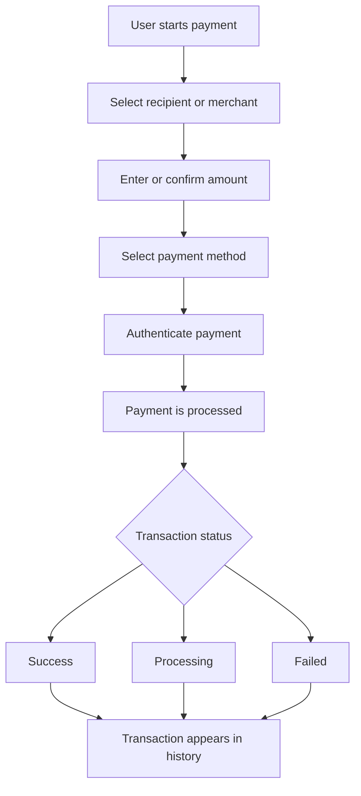

# Google Pay India: Functional and Payment Workflow Overview

## 1. Purpose

This document describes the main payment workflows available in Google Pay India and explains the basic conditions required to use them. It focuses on money transfers, bill payments, recharges, contactless payments, transaction tracking, and the security controls a user encounters during a payment.

This is a user-facing functional overview rather than a description of Google’s internal payment-processing architecture.

## 2. Product Overview

Google launched **Tez** in India in September 2017 as an India-focused digital payments app built around the Unified Payments Interface (UPI). In 2018, Tez was renamed **Google Pay** as Google consolidated its payment products under one brand.

In India, Google Pay supports several payment journeys, including:

- Sending money to another person
- Sending money to a bank account
- Paying merchants through supported payment methods
- Paying bills and recharging prepaid services
- Making eligible contactless payments using NFC
- Reviewing payment history and checking transaction status

The exact payment methods and available features can vary based on the user’s device, bank, payment method, and the service available in India.

## 3. Scope

This overview covers the following user-facing areas:

- Account and bank-account setup
- Person-to-person (P2P) and bank transfers
- Merchant payments
- Bill payments and mobile recharge
- Transaction history and payment status
- Payment authentication
- Card-based Tap & Pay
- UPI Tap & Pay
- Referral and rewards workflows
- Basic payment issue handling

## 4. Prerequisites and Account Setup

Before making UPI payments in Google Pay India, the user needs a supported bank account and a mobile number that is linked to the account. The device must also be able to send outgoing SMS during bank-account setup.

### 4.1 Typical setup flow

1. Install and open the Google Pay app.
2. Sign in with the required account details.
3. Select the bank and bank account to add.
4. Verify the account using a supported method, such as a linked debit card or Aadhaar where the bank supports Aadhaar-based onboarding.
5. Set up or enter the UPI PIN for the bank account.
6. Complete the setup and confirm that the account is available as a payment method.

Once the account is linked, the user can use the supported UPI payment options in the app.

## 5. Payment Workflow

At a high level, a payment follows this sequence:

The steps shown above describe the user-facing flow. The document does not assume details about Google’s internal banking, UPI, or risk-processing systems that are not publicly documented.

### 5.1 Sending Money

Google Pay India supports several ways to send money. Depending on the payment flow, a user can select a recipient by using a phone number, UPI ID/VPA, QR code, or bank account details with IFSC.

#### Example: UPI ID, VPA, or phone number

1. Open Google Pay and select the intended recipient.
2. Enter the amount.
3. Review the recipient and payment details.
4. Tap the option to continue with the payment.
5. Enter the UPI PIN when prompted.
6. Review the result shown in the app.

For a direct bank transfer, the user enters the recipient’s bank-account number and IFSC instead of selecting a UPI ID or phone number.

### 5.2 Receiving Money

A user can receive money when another person sends a payment to a supported identifier or payment destination associated with the recipient.

After the payment is processed, the recipient can review the transaction in Google Pay and, where applicable, confirm the credit through the linked bank account.

### 5.3 Merchant Payments

Google Pay supports merchant payments through multiple payment modes, including UPI and supported card-based options.

A typical merchant payment works as follows:

1. Select or scan the merchant’s payment option.
2. Confirm the merchant details and amount.
3. Select the available payment method.
4. Complete the required authentication.
5. Check the final transaction status.

Users should verify the merchant and amount before authorizing the payment.

### 5.4 Bill Payments and Mobile Recharge

Google Pay provides bill-payment and recharge services through supported billers and operators. Depending on availability, users may be able to pay for services such as:

- Mobile prepaid recharge
- Electricity
- Water
- Gas
- Broadband or other supported telecom services
- Insurance and other supported bill categories

The basic flow is:

1. Select the biller or service provider.
2. Enter or select the required customer details.
3. Review the bill or recharge amount.
4. Choose a payment method.
5. Authorize the payment.
6. Check the transaction result and retain the reference details if needed.

Available billers, categories, and payment methods can change over time.

## 6. Security and Payment Authentication

Google Pay uses more than one type of authentication, and these mechanisms serve different purposes.

### 6.1 App and Device Security

Google Pay can use the device’s screen lock or a Google Pay app-lock option to help protect access to the application. Supported options can include a device PIN, pattern, password, fingerprint, or Google PIN, depending on the device and configuration.

### 6.2 UPI Payment Authorization

The **UPI PIN** is separate from the app lock. It is used to authorize UPI bank transactions, such as sending money from a linked bank account.

This distinction is important because unlocking Google Pay and authorizing a UPI transaction are not necessarily the same action.

### 6.3 User Responsibility

Users should:

- Verify the recipient or merchant before making a payment.
- Never share their UPI PIN.
- Keep the device protected with an appropriate screen lock.
- Review unexpected or suspicious transactions promptly.

## 7. Transaction History and Payment Status

Google Pay provides a transaction-history view for payments made through the service. It does not represent the complete transaction history of the user’s bank account or all UPI transactions made through other applications.

A transaction can be reviewed to check details such as its status and transaction reference information.

Typical status outcomes include:

- **Success** — the payment has completed successfully.
- **Processing** — the transaction is still being processed; the user should avoid submitting the same payment again.
- **Failed** — the payment did not complete successfully.

When a transaction is delayed or fails, the user should check the transaction details and bank statement before attempting the payment again. Refund or reversal timing depends on the type of transaction and the parties involved.

## 8. Payment Issues and Disputes

Google Pay provides in-app options for reporting certain payment problems. The available support path depends on the transaction type.

Common scenarios include:

- A payment remains in processing.
- A payment is marked successful but the recipient or merchant has not received the expected result.
- A bill payment or recharge does not complete as expected.
- A failed payment has not yet been reflected as a reversal or refund in the bank account.

A practical first step is to open the transaction in Google Pay, review the current status, and use the available **Having issues?**, **Payment issue**, or dispute option where supported.

## 9. Referral and Rewards

Google Pay has referral and promotional reward programs in India. The eligibility rules, reward values, qualifying actions, and limits can change by offer.

For that reason, referral documentation should treat the reward terms as time-sensitive rather than as a permanent product rule. Users should check the offer details shown in the app before completing a referral.

## 10. Contactless Payments

Google Pay India supports contactless payment experiences on compatible devices. There are two workflows worth distinguishing: **card-based Tap & Pay** and **Tap & Pay on UPI**.

### 10.1 Card-based Tap & Pay

For supported cards, users can make contactless payments by tapping an NFC-enabled Android phone on a compatible payment terminal.

Typical prerequisites include:

- An NFC-capable Android device
- A supported debit or credit card added to Google Pay
- Contactless payments enabled for the card, where required by the issuing bank
- NFC enabled on the phone
- A screen lock configured on the device

Typical flow:

1. Unlock the phone.
2. Hold the phone near the contactless payment terminal.
3. Allow the payment to be initiated.
4. Confirm the payment result.

### 10.2 Tap & Pay on UPI

Google Pay also supports Tap & Pay on UPI for compatible NFC-enabled Android devices and supported UPI payment methods.

The user can:

1. Open Google Pay and select Tap & Pay.
2. Choose the UPI payment mode.
3. Enter the amount.
4. Tap the phone on a compatible UPI NFC device or supported merchant setup.
5. Select the payment method where required.
6. Complete the UPI authorization step when prompted.

The availability of UPI Tap & Pay depends on the device and the merchant’s supported NFC setup.

## 11. Operational Considerations

The following conditions can affect the availability or outcome of a payment:

- The user’s bank must support the relevant payment method.
- The mobile number used during UPI onboarding must meet the bank and Google Pay requirements.
- Internet access may be required for some payment flows, while certain NFC card-payment scenarios can work without an active internet connection.
- Payment limits and supported payment methods can vary by bank, card, account type, or transaction type.
- Contactless features depend on NFC support and compatible devices or payment terminals.
- A successful payment in Google Pay does not always mean that a merchant order or service has already been fulfilled.

## 12. Summary

Google Pay India combines several payment journeys in one mobile application. The most common flows involve selecting a recipient or merchant, entering or confirming the amount, choosing a payment method, completing the required authentication, and reviewing the final transaction status.

From a documentation perspective, the important distinction is between **app/device security** and **payment authorization**. UPI payments use a UPI PIN to authorize bank transactions, while device or app-lock controls protect access to the application itself.

Transaction history and in-app issue handling provide the user with a way to review payment outcomes and investigate problems. Contactless payments add another path for compatible devices, but card-based Tap & Pay and UPI Tap & Pay should be treated as separate workflows.

## 13. Source Notes

This sample was prepared from publicly available Google product announcements and Google Pay India Help documentation. Product names, UI labels, eligibility rules, supported banks, and transaction features may change over time.

Primary references consulted:

- [Google Blog — Bringing it all together with Google Pay](https://blog.google/products-and-platforms/platforms/google-pay/announcing-google-pay/)
- [Google for India — Google Pay / Tez announcement](https://blog.google/innovation-and-ai/technology/next-billion-users/google-for-india-2018/)
- [Google Pay Help — Send money](https://support.google.com/pay/india/answer/7296045?hl=en-IN)
- [Google Pay Help — Add or remove a bank account](https://support.google.com/pay/india/answer/14208881?hl=en)
- [Google Pay Help — Secure your Google Pay account](https://support.google.com/pay/india/answer/7296044?co=GENIE.Platform%3DAndroid\&hl=en)
- [Google Pay Help — Create, change, or reset your UPI PIN](https://support.google.com/pay/india/answer/9091045?hl=en-IN)
- [Google Pay Help — View transaction history](https://support.google.com/pay/india/answer/7430307?hl=en)
- [Google Pay Help — Tap your phone to make card payments](https://support.google.com/pay/india/answer/14197513?hl=en)
- [Google Pay Help — Make payments with Tap & Pay on UPI](https://support.google.com/pay/india/answer/14980962?hl=en)
- [Google Pay Help — Refer friends to Google Pay and earn rewards](https://support.google.com/pay/india/answer/16279850?hl=en-IN)